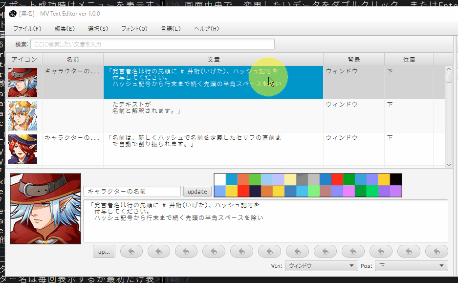
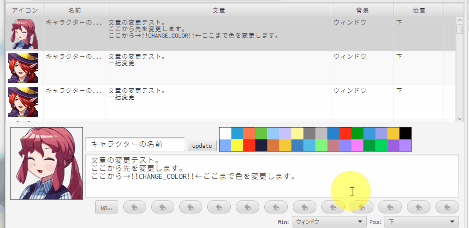
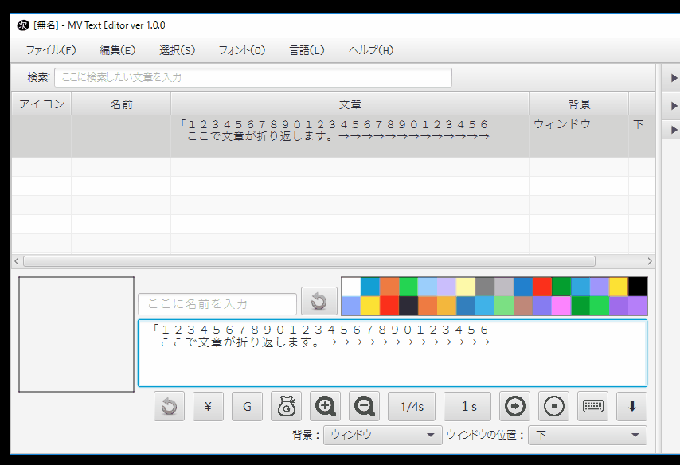

= MVTextEditor
:toc: left
:sectnums:

image:https://github.com/jiro4989/MVTextEditor/workflows/build/badge.svg[build, link=https://github.com/jiro4989/MVTextEditor/actions]
image:https://codecov.io/gh/jiro4989/MVTextEditor/branch/master/graph/badge.svg[codecov, link=https://codecov.io/gh/jiro4989/MVTextEditor]

image::./docs/demo.gif[]

== 概要

このソフトは、RPGツクールMVのイベントデータの内の、文章編集にのみ特化したテキス
ト編集ツールです。

外部エディタで作成したテキストファイルを本ソフトに読み込んで、ツクールMV側のデー
タファイルに出力する変換器としても利用出来ます。

また、ツクールMVの制御文字の入力をマウス操作から簡単に入力する機能や、
テキストの検索で特定の文章を絞り込む機能を提供します。

== インストール

https://github.com/jiro4989/MVTextEditor/releases[Releases]から各プラッ
トフォーム向けの圧縮ファイルをダウンロードして展開する。
圧縮ファイル内にはいくつかファイルがあるが、これらはセットで必要。任意のフォル
ダなどに移動したい場合は、展開したフォルダごと移動すること。

== 起動手順

. (Windows) tkfm.batをダブルクリックする
.. このとき警告が出る場合があるけれど、許可する
.. 黒いウィンドウが表示されるが、閉じないで待つ
.. GUIの画面が表示される
. (Mac/Linux) tkfmを実行する

== 使い方

=== テキストから開く

テキストファイルから本ソフトにデータを読み込みます。  
拡張子はtxtである必要があります。
また、本ソフト独自の書式でテキストを記述している必要があります。

テキストファイルの書式の詳細は
[テキストファイルの書式・仕様](#テキストファイルの書式・仕様)を参照してくださ
い。

また、テキストファイルから本ソフトへ取り込むときの書式のサンプルとして、
usage.txtというファイルを用意しました。

書式についてよくわからなかった場合は、usage.txtを開いて中身を確認してみてくださ
い。

=== 編集する

読みこんだテキストを編集します。

作者が想定している使い方は、
1. 文章と発言者のみをテキストファイルから読み込む
2. 文章の装飾を本ソフトで行う
3. ツクールMVに出力する
というものです。

本ソフトは上記の「文章の装飾」に関する機能を幾つか用意しています。

==== アイコンの変更

画面中央で、変更したいデータをダブルクリック、またはEnterすると、アイコン画像選
択ウィンドウが開きます。

これは複数選択したデータに対しても変更を適用します。  
つまり、複数のデータを一括で変更できます。

image::./gif/select_face_img01.gif[表情画像選択]

==== アイコンをキーボードから変更

アイコンを一度表示すると、キーボードの数字キーで変更を受け付けるようになりま
す。

データを選択して1 ~ 8のいずれかのキーを押すと、アイコンを変更します。

image::./gif/change_face_img01.gif[表情パネル変更]

==== データの一括変更

アイコンを一括変更できることと同様に、アクター名や文章を一括変更できます。

操作まず編集したいデータを選択し、画面下部の編集欄からテキストを入力することで適
用されます。

選択したデータの１つは、リアルタイムで変更がテーブルに反映されます。

この時、複数のデータを変更する時は、テキスト入力欄に隣接するボタンを押下しない
と、一括変更が適用されません。

==== データの切り取り-コピー-削除

複数データの一括削除、一括コピーをサポートします。  
詳細は[ショートカットキー](#ショートカットキー)の項目を参照してください。

==== 色文字列の入力

文章の色を変更したい場合は、変更したい箇所にカーソルを移動し、文章入力欄の上部に
ある色パネルをダブルクリックしてください。

この時、テキストで範囲を選択していた場合、その選択部分のみを色制御文字でくくりま
す。  
その場合、制御文字の閉じる部分は\i[0]が挿入されます。

==== 制御文字の支援

ツクールのすべての制御文字の入力をボタンから行う事が可能です。

テキスト入力欄下部のボタンをクリックすることで、制御文字を挿入することが可能で
す。

この時、フォントサイズの変更、一瞬で文章を表示に関しては、色文字列の入力の場合と
同様に選択範囲にのみ適用できる様になっています。

==== 変数-アクター-アイコンの挿入

画面右側のパネルに、変数・アクター・アイコンの一覧パネルが存在します。

それぞれダブルクリック、あるいはEnterキーでカーソル位置に文章の挿入を可能としま
す。

image::./gif/var_actor_icon01.gif[表情パネル変更]

また、アクター名については、アクター名を選択した状態でSpaceをタイプすることで発
言者のテキスト入力欄にアクター名を入力できます。アクター名の入力の際に前後に幾つ
かの括弧で囲むことが可能です。

==== 文字列の折り返し

文章表示ウィンドウ内に収まりきらない場合に文章を折り返します。

画面解像度を変更するプラグインを適用している場合は、インポート設定から折り返す文
字数を変更することで、文字列の折り返しを最適化することができます。

だだし、ここで指定する数値は半角英数字の幅を基準にしている点に注意してください。
半角英数字を幅1として、全角文字を幅2として計算しています。
なので、全て全角文字の場合は27文字入力された時点で文章が折り返されます。

image::./gif/return01.gif[表情パネル変更]

==== 複数レコードの連結

複数のレコードを連結して１つのレコードにまとめます。

==== 複数レコードの一括編集

レコードの編集はリアルタイムで変更が適用されますが、複数のレコードを対象とした場
合、手動で適用する必要があります。

image::./gif/joining01.gif[表情パネル変更]

=== MVに出力する

メニューから「MapXXX.jsonを出力する」を実行してください。

正常に出力できた場合、お疲れ様ですウィンドウが表示されます。
お疲れ様です。

=== 確認する

ツクールMVで確認します。

幅1x1でイベントが１つ存在する新しいマップが生成されていることを確認してくださ
い。

生成されたイベントを確認して、必要に応じて修正したり、別の場所にコピペしてご利用
ください。

=== ショートカットキー

[options="header"]
|=========
| キー| 動作| 備考
| ファイル||
| Ctrl-N| 新規データの作成|
| Ctrl-O| ファイルを開く|
| Ctrl-S| ファイルの保存|
| Ctrl-Shift-S | ファイルの別名保存|
| Ctlr-Shift-T | テキストファイルを開く |
| Ctrl-Shift-M | MVに出力|
| 編集||
| Ctrl-R| ファイルの再読込|
| Ctrl-X| 切り取り| 複数可
| Ctrl-C| コピー| 複数可
| Ctrl-V| 貼り付け|
| Ctrl-D| 削除| 複数可
| Ctrl-G| 選択データの更新| 複数可
| Ctrl-I| 新規データの挿入|
| Ctrl-J| 下のデータを選択|
| Ctrl-K| 上のデータを選択|
| Ctrl-F| 文章の折り返し| 複数可
| Ctrl-M| 文章の連結| 複数可
| 1| 表情1に変更| 複数可
| 2| 表情2に変更| 複数可
| 3| 表情3に変更| 複数可
| 4| 表情4に変更| 複数可
| 5| 表情5に変更| 複数可
| 6| 表情6に変更| 複数可
| 7| 表情7に変更| 複数可
| 8| 表情8に変更| 複数可
| 選択||
| Ctrl-U| エディタを選択|
| Ctrl-Shift-J | 変数パネルを選択|
| Ctrl-Shift-K | アクターパネルを選択|
| Ctrl-Shift-L | アイコンパネルを選択|
| テーブル||
| J| 下のデータを選択|
| K| 上のデータを選択|
| Enter| アイコンの変更| 複数可
| Space| 発言者の変更| アクター 
| F1| バージョン情報|
|=========

== テキストファイルの書式-仕様

- テキストファイルは文字コードがUTF-8、またはShift_JIS (ANSI)で保存されている必
  要があります。  
  文字コードについてはお使いのテキストエディタ(テキストファイルを編集するために
  使っているソフト)と文字コードでググってもらえるとすぐに情報が見つかるかと思い
  ます。 +
  参考までに、Windowsのメモ帳でしたら名前をつけて保存する時に、保存ボタンの横に
  文字コードというプルダウンメニューがあります。  
  そこを選択して、UTF-8という項目を選択して保存したテキストファイルなら、正常に
  読み込むことが可能です。

- # (ハッシュ記号)で始まる行で、#１文字で始まる行は、発言者の名前です。  
  発言者の名前、とはツクールMVの文章ウィンドウの１行目に表示されるセリフの発言者
  を想定しています。

- ##で始まる行(#が２文字以上連続する行)はコメント行です。  
  コメント行とは、「データ読み込み時に無視される」行です。  
  これは、そのテキストファイルを読む人間に文章の分かりやすさを提供するための機能
  です。

- １つ以上連続する空白行(何も書いていない行)が文章の区切りになります。  
  文章が始まってから、次の空白行までを一つの段落と解釈し、本ソフトに取り込みま
  す。

- １行あたりの文章がツクールMVのウィンドウ内に収まりきらない場合、読み込み時に自
  動で収まるように改行します。  
  この時、ウィンドウの幅をプラグインなどで変更している場合は、インポート設定の項
  目から折り返す文字数を変更できます。

- 文章の開始と終わりを括弧でくくって本ソフトに読み込むことが可能です。  
  インポート設定の画面から、このオプションを変更することが可能です。  
  この設定はデフォルトでONになっています。

- 発言者が連続する場合、発言者の名前の記述を省略できます。  
  つまり、同じ人物のセリフは、最初の一つだけ記述するだけで良いのです。  
  発言者を切り替えたい場合は、再度#で名前を指定する必要があります。

- 文章ウィンドウ４行すべてを文章にしたい場合は、その段落の直前に#のみを記述し、
  発言者名を何も入力しないことで実現できます。

- 文章ウィンドウの１行目を空白で残しておきたい場合は、# 　(全角スペース)を入力
  することで実現できます。

- 発言者と同じ名前をテキスト欄で表現する際に、@nameと記述することで、本ソフトに
  読み込む時に発言者の名前に置換されます。

== Q & A

=== Q1. 実行ファイルをダブルクリックしても動作しない

ご利用の環境にJavaがインストールされているか確認してください。また、Javaがインス
トールされていても、本ソフト作成時のJavaのバージョン以下をご利用の場合、動作しな
い場合があります。

Javaのインストール、アップデート方法については[動作条件](#動作条件)の項目を参照
してください。

=== Q2. 以前は動いていたのに突然起動しなくなった

実行時に自動生成されたフォルダをすべて削除してください。ただし、これはあくまでも
一時的な対処法です。

もしそれで起動するようになったのでしたら、よろしければ作者にバグ報告していただけ
ると助かります。また、起動しなくなる前に何を行っていたかも報告していただけると、
本ソフトのバグ修正が容易になり、品質向上に役立てることができます。

=== Q3. READMEのレイアウトが崩れている

仕様です。フォントが異なるとレイアウトが崩れて見えることがあります。

メモ帳などでこのドキュメントを開いているのでしたら、書式メニューのフォントからMS
ゴシック(MS Pゴシックではありません)を選択すると作者が期待している通りのレイアウ
ト表示になります。

=== Q4. Mac, Linuxでツクールに出力できない

すいません。私がツクールをWindows版しか持っていないので、Linux, Macだと正常に出
力できるかテストできていません。

ソフト単体はWin, Mac, Linuxどれでも動作するように実装したつもりですが、出力して
動作するかどうかは確認できていません。

なので、もしMacやLinuxでツクールに出力したときに正常に出力できない可能性がありま
す。

=== Q5. 文章入力欄のフォントが見づらい

本ソフトではそれぞれの文字の横幅をすべて同じにするために**MS Gothic**を指定して
います。

一般に見やすいとされるプロポーショナルフォントは文字ごとの横幅が異なるため、文字
の折り返しが実行されるタイミングを見分けることを難しくさせます。

ツクールではほぼ等幅フォントなので、ソレと同じような見た目になるように、多少見づ
らくなってしまってもWindowsの標準で含まれる等幅フォントを指定しています。

ただし、それは特定の等幅フォントが含まれていなかった場合にのみ適用されます。

例えば作者は**Myrica M**という等幅フォントをインストールしていて、それがPCにイン
ストールされていれば、最初にソレが適用されるようになっています。  
(これは完全に作者用の設定です。)

=== Q6. SpaceやEnterでボタンを選択したりできない

全角入力状態(日本語入力状態)だと選択できません。
全角入力状態になっていないか確認してみてください。

=== Q7. テキストファイルから開いた時に最後の文章が読み込まれない

ファイルの末尾に改行を追加してください。

本ソフトは空白行で文章の区切りを判断するため、
テキストファイルの末尾に空白行です。

これに関しては現時点では仕様とさせてください。

=== Q8. インデントした状態で始まった行で文字列の折り返しを実行するとインデントがなくなる

すいません。既知の不具合です。  
全力で修正するので、今しばらくお待ち下さい。

=== Q9. テキストファイルを開けない

テキストファイルの文字コードが対応していない可能性があります。  
用意されているテキストファイルの文字コードを確認してください。

メモ帳でしたら、名前をつけて保存を行う時に、保存ボタンの横の文字コードというプル
ダウンメニューから、ANSIまたはUTF-8という項目を選択してください。

== アンインストール

フォルダごと削除する。

== 連絡先

バグ報告、機能要望、質問などがあれば、リポジトリのissuesに起票ください。

それ以外については、以下に連絡ください。

https://twitter.com/jiro_saburomaru[@jiro_saburomaru]

== LICENSE

GPL-2.0

=== 画像提供

ボタンアイコンは以下よりお借りしています。
画像の無断配布はお控えください。

* http://icooon-mono.com[icooon-mono]
* http://www.webiconset.com/[WebIconSet.com]

== 開発者向け

=== 前提条件

* Java 14

環境変数JAVA_HOMEも設定すること。
以下のコマンドでUbuntuでは環境が整う。

[source,bash]
----
curl -O https://download.java.net/java/GA/jdk14/076bab302c7b4508975440c56f6cc26a/36/GPL/openjdk-14_linux-x64_bin.tar.gz
tar xvf openjdk-14_linux-x64_bin.tar.gz

mkdir -p /opt/java
mv jdk-14 /opt/java/
ln -sfn /opt/java/jdk-14 /opt/java/current

export JAVA_HOME=/opt/java/current
----

=== ビルド手順

以下のコマンドを実行する。

[source,bash]
----
./gradlew build
----

=== アプリ起動手順

前述のビルドコマンドを実行後に以下のコマンドを実行する。

実行する前提条件として、下記スクリプトにかかれている `module-path`
のパスにJavaFX SDKがインストールされている必要がある。 JavaFX SDKは
https://gluonhq.com/products/javafx/[JavaFXのサイト]
からSDKをダウンロードしてきて圧縮ファイルを展開して配置する。

[source,bash]
----
./gradlew clean build runApp
----

=== カスタムJREの作成手順

以下のコマンドを実行する。成果物としてjreディレクトリが作成される。

アプリが依存しているモジュールは `modules.txt`
に記載。ここに追記するとスクリプトにも反映される。

実行する前提条件として、前述のJavaFXのサイトにて配布されているJMODSが必要。
こちらをダウンロードしてきて、 `./jmods/javafx-jmods-11.0.2` に配置する。

配置後に以下のコマンドを実行する。

[source,bash]
----
./gradlew jlink
----

=== カスタムJREを使用してアプリを起動する手順

以下の手順を実施する。

* ビルド手順
* カスタムJRE作成手順

実施の後、以下のコマンドを実行する。

[source,bash]
----
./jre/bin/java -jar build/libs/tkfm-dev.jar com.jiro4989.tkfm.Main
----

これで起動しなければ何かがおかしい。

=== リリース手順

リリースドラフトをpublishすると配布物がリリースされる。
リリースはすべてCI環境で行うため、環境を整える必要はない。

masterブランチが更新されるとGitHubActionsが走る。
masterでGitHubActionsが走ると、リリースのドラフトが作成される。
リリースドラフトをpublishすると、GitHubActionsが起動する。

タグを切ったときのGitHubActionsのワークフローでは、
前述のビルドとカスタムJRE作成と同様の処理が走る。

生成された各プラットフォーム向けの配布物をGitHubReleaseに添付する。

