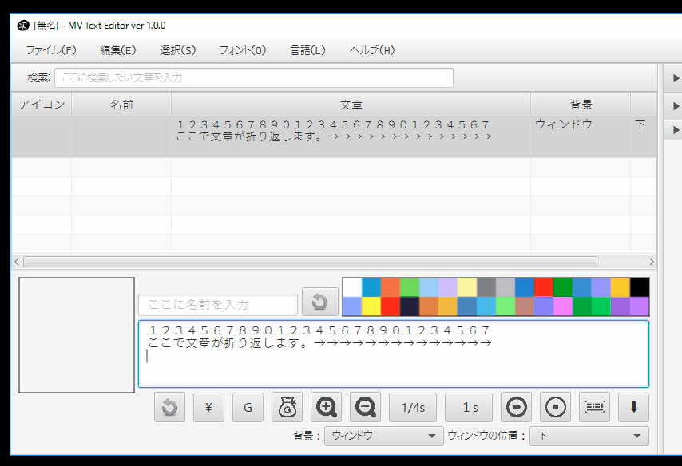

(実装途中) MV Text Editor マニュアル
================================================================================

- バージョン       : 1.0.0
- 作者             : 次郎 (Jiro)
- 作成日           : 2017/05/10
- 最終更新日       : 2017/05/10
- 連絡先           : [次ログ](http://jiroron666.hatenablog.com/)
- 実行ファイル名   : mvte.jar
- 動作確認・開発環境
  - OS             : Windows 10 Home
  - プロセッサ     : 3.50GHz Intel Core i7-4770K
  - メモリ         : 8GB RAM
  - Javaバージョン : 1.8.0-121

目次
--------------------------------------------------------------------------------

1. [ソフトウェア概要                  ](#ソフトウェア概要)
1. [ファイル構成                      ](#ファイル構成)
1. [動作条件                          ](#動作条件)
1. [実行方法                          ](#実行方法)
1. [使い方                            ](#使い方)
   1. [ファイルを開く                 ](#ファイルを開く)
   1. [画像の確認                     ](#画像の確認)
   1. [表示するレイアウトの調整       ](#表示するレイアウトの調整)
1. [画像規格プリセット                ](#画像規格プリセット)
   1. [プリセットの確認               ](#プリセットの確認)
   1. [プリセットの編集               ](#プリセットの編集)
      1. [プリセット編集画面の操作方法](#プリセット編集画面の操作方法)
1. [ショートカットキー                ](#ショートカットキー)
1. [FAQ                               ](#FAQ)
1. [利用規約                          ](#利用規約)
   1. [補足                           ](#補足)
1. [バージョンアップ方法              ](#バージョンアップ方法)
1. [その他・作者からのお願い          ](#その他・作者からのお願い)
1. [アンインストール方法              ](#アンインストール方法)
1. [更新履歴                          ](#更新履歴)

ソフトウェア概要
--------------------------------------------------------------------------------

このソフトは、RPGツクールMVのイベントデータの内の、文章編集にのみ特化したテキス
ト編集ツールです。

外部エディタで作成したテキストファイルを本ソフトに読み込んで、ツクールMV側のデー
タファイルに出力する変換器としても利用出来ます。

また、ツクールMVの制御文字の入力をマウス操作から簡単に入力する機能や、
テキストの検索で特定の文章を絞り込む機能を提供します。

ファイル構成
--------------------------------------------------------------------------------

zip配布時の構成

- README.html        : READMEへのリンク
- java_download.html : Javaアップデート公式サイトへのリンク
- mvte.jar           : 実行ファイル

初回起動時に生成されるフォルダ (各種ファイルの保存・管理用)

- errors     : エラーが発生した時の記録保存
- properties : 設定ファイル

上記の生成されるフォルダ類は、アンインストールする時以外に場所を移動したり、削除
したりしないようにしてください。予期せぬ動作の原因になります。

動作条件
--------------------------------------------------------------------------------

本ソフトを実行するにはJavaがインストールされている必要があります。また、本ソフト
作成時のJavaのバージョン以上がインストーされている必要があります。

もし本ソフトをダブルクリックで実行できなかった場合は、Webブラウザで下記URLの公式
サイトを開くか、同封の java_download.html をダブルクリックして公式サイトを開いて
Javaをインストールまたはアップデートしてください。

[Javaダウンロード](https://java.com)

それでも起動できなかった場合は、お手数ですがFAQの項目を確認した後に、本ドキュメ
ント先頭の連絡先より作者にご報告ください。

実行方法
--------------------------------------------------------------------------------

"mvte.jar"をダブルクリックしてください。LinuxOSをご使用の方はターミナルから
"java -jar mvte.jar"と打ち込んでください。

使い方
--------------------------------------------------------------------------------

### テキストから開く

テキストファイルから本ソフトにデータを読み込みます。  
拡張子は特に指定ありませんが、特定の書式に従っている必要があります。

テキストファイルの書式の詳細は
[テキストファイルの書式・仕様](#テキストファイルの書式・仕様)を参照してくださ
い。

### 編集する

読みこんだテキストを編集します。

作者が想定している使い方は、
1. 文章と発言者のみをテキストファイルから読み込む
2. 文章の装飾を本ソフトで行う
3. ツクールMVに出力する
というものです。

本ソフトは上記の「文章の装飾」に関する機能を幾つか用意しています。

#### アイコンの変更

画面中央で、変更したいデータをダブルクリック、またはEnterすると、アイコン画像選
択ウィンドウが開きます。

これは複数選択したデータに対しても変更を適用します。  
つまり、複数のデータを一括で変更できます。

#### アイコンをキーボードから変更

アイコンを一度表示すると、キーボードの数字キーで変更を受け付けるようになりま
す。

データを選択して1 ~ 8のいずれかのキーを押すと、アイコンを変更します。

#### データの一括変更

アイコンを一括変更できることと同様に、アクター名や文章を一括変更できます。

操作まず編集したいデータを選択し、画面下部の編集欄からテキストを入力することで適
用されます。

選択したデータの１つは、リアルタイムで変更がテーブルに反映されます。

この時、複数のデータを変更する時は、テキスト入力欄に隣接するボタンを押下しない
と、一括変更が適用されません。

#### データの切り取り、コピー、削除

複数データの一括削除、一括コピーをサポートします。  
詳細は[ショートカットキー](#ショートカットキー)の項目を参照してください。

#### 色文字列の入力

文章の色を変更したい場合は、変更したい箇所にカーソルを移動し、文章入力欄の上部に
ある色パネルをダブルクリックしてください。

この時、テキストで範囲を選択していた場合、その選択部分のみを色制御文字でくくりま
す。  
その場合、制御文字の閉じる部分は\i[0]が挿入されます。

#### 制御文字の支援

ツクールのすべての制御文字の入力をボタンから行う事が可能です。

テキスト入力欄下部のボタンをクリックすることで、制御文字を挿入することが可能で
す。

この時、フォントサイズの変更、一瞬で文章を表示に関しては、色文字列の入力の場合と
同様に選択範囲にのみ適用できる様になっています。

#### 変数・アクター・アイコンの挿入

画面右側のパネルに、変数・アクター・アイコンの一覧パネルが存在します。

それぞれダブルクリック、あるいはEnterキーでカーソル位置に文章の挿入を可能としま
す。

#### 文字列の折り返し (Ctrl + F)

文章表示ウィンドウ内に収まりきらない場合に文章を折り返します。

画面解像度を変更するプラグインを適用している場合は、インポート設定から折り返す文
字数を変更することで、文字列の折り返しを最適化することができます。

だだし、ここで指定する数値は半角英数字の幅を基準にしている点に注意してください。
半角英数字を幅1として、全角文字を幅2として計算しています。
なので、全て全角文字の場合は27文字入力された時点で文章が折り返されます。

#### 複数レコードの連結 (Ctrl + M)

複数のレコードを連結して１つのレコードにまとめます。

#### 複数レコードの一括編集 (Ctrl + G)

レコードの編集はリアルタイムで変更が適用されますが、複数のレコードを対象とした場
合、手動で適用する必要があります。

### MVに出力する

メニューからMVに出力するを実行してください。

正常に出力できた場合、お疲れ様ですウィンドウが表示されます。
お疲れ様です。

### 確認する

ツクールMVで確認します。

幅1x1でイベントが１つ存在する新しいマップが生成されていることを確認してくださ
い。

生成されたイベントを確認して、必要に応じて修正したり、別の場所にコピペしてご利用
ください。

ショートカットキー
--------------------------------------------------------------------------------

| キー         | 動作                   | 備考   |
|:-------------|:-----------------------|:-------|
| ファイル     |                        |        |
| Ctrl-N       | 新規データの作成       |        |
| Ctrl-O       | ファイルを開く         |        |
| Ctrl-S       | ファイルの保存         |        |
| Ctrl-Shift-S | ファイルの別名保存     |        |
| Ctlr-Shift-T | テキストファイルを開く |        |
| Ctrl-Shift-M | MVに出力               |        |
| 編集         |                        |        |
| Ctrl-R       | ファイルの再読込       |        |
| Ctrl-X       | 切り取り               | 複数可 |
| Ctrl-C       | コピー                 | 複数可 |
| Ctrl-V       | 貼り付け               |        |
| Ctrl-D       | 削除                   | 複数可 |
| Ctrl-G       | 選択データの更新       | 複数可 |
| Ctrl-I       | 新規データの挿入       |        |
| Ctrl-J       | 下のデータを選択       |        |
| Ctrl-K       | 上のデータを選択       |        |
| Ctrl-F       | 文章の折り返し         | 複数可 |
| Ctrl-M       | 文章の連結             | 複数可 |
| 1            | 表情1に変更            | 複数可 |
| 2            | 表情2に変更            | 複数可 |
| 3            | 表情3に変更            | 複数可 |
| 4            | 表情4に変更            | 複数可 |
| 5            | 表情5に変更            | 複数可 |
| 6            | 表情6に変更            | 複数可 |
| 7            | 表情7に変更            | 複数可 |
| 8            | 表情8に変更            | 複数可 |
| 選択         |                        |        |
| Ctrl-U       | エディタを選択         |        |
| Ctrl-Shift-J | 変数パネルを選択       |        |
| Ctrl-Shift-K | アクターパネルを選択   |        |
| Ctrl-Shift-L | アイコンパネルを選択   |        |
| テーブル     |                        |        |
| J            | 下のデータを選択       |        |
| K            | 上のデータを選択       |        |
| Enter        | アイコンの変更         | 複数可 |
| F1           | バージョン情報         |        |

テキストファイルの書式・仕様
--------------------------------------------------------------------------------

- テキストファイルは文字コードがUTF-8、またはShift_JISで保存されている必要があり
  ます。
  文字コードについてはお使いのテキストエディタ(テキストファイルを編集するために
  使っているソフト)と文字コードでググってもらえるとすぐに情報が見つかるかと思い
  ます。

  参考までに、Windowsのメモ帳でしたら名前をつけて保存する時に、保存ボタンの横に
  文字コードというプルダウンメニューがあります。
  そこを選択して、UTF-8という項目を選択して保存したテキストファイルなら、正常に
  読み込むことが可能です。

- \# (ハッシュ記号)で始まる行で、\#１文字で始まる行は、発言者の名前です。  
  発言者の名前、とはツクールMVの文章ウィンドウの１行目に表示されるセリフの発言者
  を想定しています。

- \#\#で始まる行(\#が２文字以上連続する行)はコメント行です。  
  コメント行とは、「データ読み込み時に無視される」行です。  
  これは、そのテキストファイルを読む人間に文章の分かりやすさを提供するための機能
  です。

- １つ以上連続する空白行(何も書いていない行)が文章の区切りになります。  
  文章が始まってから、次の空白行までを一つの段落と解釈し、本ソフトに取り込みま
  す。

- １行あたりの文章がツクールMVのウィンドウ内に収まりきらない場合、読み込み時に自
  動で収まるように改行します。  
  この時、ウィンドウの幅をプラグインなどで変更している場合は、インポート設定の項
  目から折り返す文字数を変更できます。

- 文章の開始と終わりを括弧でくくって本ソフトに読み込むことが可能です。  
  インポート設定の画面から、このオプションを変更することが可能です。  
  この設定はデフォルトでONになっています。

- 発言者が連続する場合、発言者の名前の記述を省略できます。  
  つまり、同じ人物のセリフは、最初の一つだけ記述するだけで良いのです。  
  発言者を切り替えたい場合は、再度\#で名前を指定する必要があります。

- 文章ウィンドウ４行すべてを文章にしたい場合は、その段落の直前に\#のみを記述し、
  発言者名を何も入力しないことで実現できます。

- 文章ウィンドウの１行目を空白で残しておきたい場合は、\# 　(全角スペース)を入力
  することで実現できます。

- 発言者と同じ名前をテキスト欄で表現する際に、@nameと記述することで、本ソフトに
  読み込む時に発言者の名前に置換されます。

FAQ
--------------------------------------------------------------------------------

### Q1. 実行ファイルをダブルクリックしても動作しない

ご利用の環境にJavaがインストールされているか確認してください。また、Javaがインス
トールされていても、本ソフト作成時のJavaのバージョン以下をご利用の場合、動作しな
い場合があります。

Javaのインストール、アップデート方法については[動作条件](#動作条件)の項目を参照
してください。

### Q2. 以前は動いていたのに突然起動しなくなった

実行時に自動生成されたフォルダをすべて削除してください。ただし、これはあくまでも
一時的な対処法です。

もしそれで起動するようになったのでしたら、よろしければ作者にバグ報告していただけ
ると助かります。また、起動しなくなる前に何を行っていたかも報告していただけると、
本ソフトのバグ修正が容易になり、品質向上に役立てることができます。

### Q3. READMEのレイアウトが崩れている

仕様です。フォントが異なるとレイアウトが崩れて見えることがあります。

メモ帳などでこのドキュメントを開いているのでしたら、書式メニューのフォントからMS
ゴシック(MS Pゴシックではありません)を選択すると作者が期待している通りのレイアウ
ト表示になります。

### Q4. Mac, Linuxでツクールに出力できない

すいません。私がツクールをWindows版しか持っていないので、Linux, Macだと正常に出
力できるかテストできていません。

ソフト単体はWin, Mac, Linuxどれでも動作するように実装したつもりですが、出力して
動作するかどうかは確認できていません。

なので、もしMacやLinuxでツクールに出力したときに正常に出力できない可能性がありま
す。

### Q5. 文章入力欄のフォントが見づらい

本ソフトではそれぞれの文字の横幅をすべて同じにするために**MS Gothic**を指定して
います。

一般に見やすいとされるプロポーショナルフォントは文字ごとの横幅が異なるため、文字
の折り返しが実行されるタイミングを見分けることを難しくさせます。

ツクールではほぼ等幅フォントなので、ソレと同じような見た目になるように、多少見づ
らくなってしまってもWindowsの標準で含まれる等幅フォントを指定しています。

ただし、それは特定の等幅フォントが含まれていなかった場合にのみ適用されます。

例えば作者は**Myrica M**という等幅フォントをインストールしていて、それがPCにイン
ストールされていれば、最初にソレが適用されるようになっています。  
(これは完全に作者用の設定です。)

利用規約
--------------------------------------------------------------------------------

- 配布している素材を利用したことで発生した問題に対して、私は一切の責任を負いませ
  ん。

- 著作権は私(次郎)が有しています。私が死亡して50年経過するまで決して放棄すること
  はありません。

- 再配布はお控えください。

- 利用規約を事前連絡なしに変更する場合があります。その場合は最新の規約が適用され
  るものとします。

### 補足

利用できる作品

- ツクール用に作成しましたがツクール作品以外の素材作成が目的でも利用可能です。
- 有償作品、エロゲー、グロゲーでも利用可能です。
- ゲーム作品以外でも利用可能です。

利用報告

- READMEへの記載は利用者の任意です。私から強制することはありません。
- 使用報告もしなくて結構です。したいひとだけしてください。

バージョンアップ
--------------------------------------------------------------------------------

本ソフト配布時のzipに同封のREADME.htmlをダブルクリックしてください。本ソ
フトのプログラムを公開しているGithubというサイトにジャンプします。

移動先のサイトに表示されているバージョン情報が、現在ご使用のバージョンよりも上
がっている場合は、移動先サイトの実行ファイルをダウンロードしてご利用ください。

ダウンロード方法がわからなかった場合は、本ソフトをダウンロードしたツクマテコミュ
ニティ・または作者ブログのソフト配布ページのDropboxのリンクから、最新版をダウン
ロードしてください。

その他・作者からのお願い
--------------------------------------------------------------------------------

- バグの報告は連絡先の作者ブログか、ツクマテコミュニティのツール配布のページでお
  願いします。

- 新しい機能の実装のご要望をいただいた場合、実装する場合もあるかもしれませんが、
  必ずではないことをご了承ください。

アンインストール方法
--------------------------------------------------------------------------------

本ソフトはレジストリを変更していませんので、配布時のzipフォルダごとゴミ箱にぶち
込んでいただければアンインストールできます。

もし本ソフトの実行ファイルをフォルダの外に移動して実行した場合は、自動で生成され
る各種フォルダを削除していただければ、アンインストールは完了です。

実行時に生成されるフォルダについては[ファイル構成](#ファイル構成)の項目を参照し
てください。

更新履歴
--------------------------------------------------------------------------------

Ver1.0.0 : TODO
- プログラム公開
